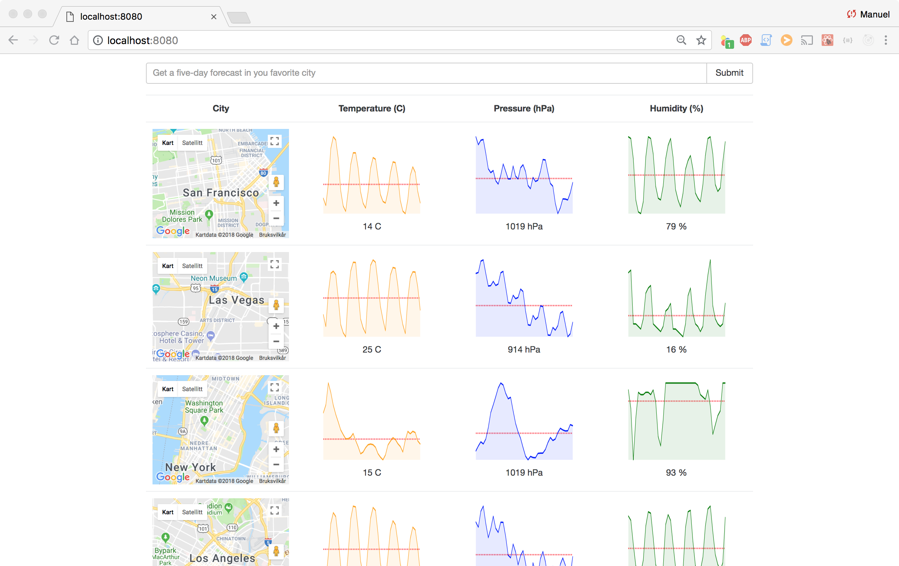

## Project Description:

This project creates a weather forecast service using [openweathermap](https://openweathermap.org/api "openweathermap") api. The graphs are built with [react-sparklines](https://www.npmjs.com/package/react-sparklines "react-sparklines") and the maps are implemented with [Google Maps Api](https://developers.google.com/maps/documentation/javascript/tutorial "Google Maps Api").

The project is done together with the great React and Redux turorial from Stephen Grider:

   [Modern React with Redux](https://www.udemy.com/react-redux/ "Modern React with Redux")

## Installing:

####  Dependencies

You need to have Node.js installed to run the project

[Download Node.js](https://nodejs.org/en/download/ "Download Node.js")

Check in linux terminal that package was installed properly

`node -v`

Check also npm is installed

`npm -v`

#### On linux terminal

1. In target directory clone the repository from gitHub

	` git clone https://github.com/manuelAlonsoPerez/weatherApp_redux_middleware.git`

2. Navigate to project folder

	`cd weatherApp_redux_middleware`

3. Install package

	`npm install`

4. Run project

	`npm start`

5.Open a new browser window and navigate to

    http://localhost:8080/

#### Alternatively

Download  .zip, .tar, .tar.gz or .tar compressed package, decompress it to target folder and follow from Step 2.

## Status

The  project is working and is possible to search for the weather of cities in the US.  The graphs show the temperature, pressure and humidity for the last 5 days / every 3 hours.

The store is binded to Redux Promise middleware to assure correct functioning of async Api calls.

